# Kintsugi-GRC RAG Pipeline & Hybrid Retrieval Architecture

## 1. Executive Architecture Overview

Kintsugi-GRC employs a **Hybrid RAG (Retrieval-Augmented Generation)** architecture designed for low-latency, deterministic compliance advisory generation. It combines dense semantic vector search via **FAISS** with sparse relational keyword matching over an **SQLite** control database, complete with strict industry scoping and deterministic fallbacks.

```mermaid
graph TB
    %% STYLING
    classDef inputStyle fill:#1E293B,stroke:#38BDF8,stroke-width:2px,color:#F8FAFC;
    classDef denseStyle fill:#064E3B,stroke:#34D399,stroke-width:2px,color:#F8FAFC;
    classDef sparseStyle fill:#312E81,stroke:#818CF8,stroke-width:2px,color:#F8FAFC;
    classDef fusionStyle fill:#701A75,stroke:#F472B6,stroke-width:2px,color:#F8FAFC;
    classDef outputStyle fill:#1C1917,stroke:#F59E0B,stroke-width:2px,color:#F8FAFC;
    classDef dbStyle fill:#1F2937,stroke:#9CA3AF,stroke-width:2px,color:#F8FAFC;

    %% INGESTION TRACK
    subgraph INGESTION ["📥 1. Ingestion & Dual Indexing"]
        direction LR
        KB["Compliance Standards (HIPAA, PCI-DSS, NIST)"]:::inputStyle --> PolicyIngester["RelationalPolicyIngester"]:::inputStyle
        CustomDoc["Custom Policies (JSON / TXT)"]:::inputStyle --> PolicyIngester
        PolicyIngester -->|BGE-Large-v1.5 1024-dim| FAISS[("FAISS Index<br/>(compliance_index.faiss)")]:::dbStyle
        PolicyIngester -->|Relational Rows (doc_id)| SQLite[("SQLite DB<br/>(compliance_rules)")]:::dbStyle
    end

    %% SCANNER TRIGGER
    subgraph TRIGGER ["🔍 2. Scanner Trigger"]
        ScanEngine["Scanner Engine"]:::inputStyle -->|Detects Finding| Payload["Finding Payload<br/>• Rule ID: PERMISSIVE_ACCESS...<br/>• Filepath: /etc/ssl/openssl.cnf<br/>• Details: 0o777"]:::inputStyle
    end

    %% HYBRID RETRIEVAL CORE
    subgraph RETRIEVAL ["⚡ 3. Hybrid Retrieval Engine (orchestrator.py)"]
        Payload --> Router{"ML Ready?"}:::inputStyle
        IndustryScope["Industry Filter<br/>(Healthcare / Merchant / Finance / Banking)"]:::inputStyle --> Filter

        Router -->|Yes| Dense["🟢 Dense Vector Search<br/>• SentenceTransformer embed<br/>• FAISS top-K cosine sim"]:::denseStyle
        Router -->|Yes / Fallback| Sparse["🔵 Sparse Relational Search<br/>• Keyword frequency match<br/>• SQLite compliance_rules"]:::sparseStyle

        Dense -->|vector_similarity| Fusion["🔮 Hybrid Rank Fusion<br/>hybrid_score = (sim × 4.0) + sparse + custom_boost"]:::fusionStyle
        Sparse -->|keyword_matches| Fusion

        Fusion --> Filter["🛡️ Industry Scoping & Filtering<br/>_matches_industry(clause_id, standard)"]:::fusionStyle
        Filter --> RankedClauses["Top-K Scored & Deduplicated Clauses"]:::fusionStyle
    end

    %% SYNTHESIS & OUTPUT
    subgraph OUTPUT ["📋 4. Advisory Synthesis & Audit Logging"]
        RankedClauses --> Composer["Advisory Card Builder"]:::outputStyle
        FallbackDict["Deterministic Fallback Dict<br/>(Exact Shell Commands & Standard baseline)"]:::inputStyle --> Composer

        Composer --> FinalCard["Remediation Advisory Card<br/>━━━━━━━━━━━━━━━━━━━━━━━━━━━━<br/>• Clause: HIPAA §164.312(a)(1) / PCI 7.2.1<br/>• Remediation: chmod 640 /path/to/file<br/>• Rationale + Scored Context Chunks<br/>• Execution Mode: HYBRID"]:::outputStyle

        FinalCard --> LogDB[("SQLite Log<br/>(remediation_cards)")]:::dbStyle
        FinalCard --> UI["Web UI / CLI Report"]:::outputStyle
    end

    %% CONNECTIONS ACROSS PHASES
    FAISS -.->|Vector Lookup| Dense
    SQLite -.->|Table Query| Sparse
```

---

## 2. End-to-End Sequence Flow

```mermaid
sequenceDiagram
    autonumber
    actor Scanner as Scanner / Client
    participant Orch as RelationalRAGOrchestrator
    participant Model as SentenceTransformer (BGE-Large)
    participant FAISS as FAISS Vector Index
    participant DB as SQLite (compliance_rules)
    actor Auditor as Audit DB / UI

    Scanner->>Orch: generate_advisory(violation_code, payload, industry="Healthcare")
    
    rect rgb(30, 45, 60)
        Note over Orch,FAISS: Branch 1: Dense Vector Search
        Orch->>Model: encode(query + topic_keywords)
        Model-->>Orch: normalized query embedding (1024-dim)
        Orch->>FAISS: search(query_vector, k=top_k*3)
        FAISS-->>Orch: distances (cosine sim), doc_ids
    end

    rect rgb(30, 40, 50)
        Note over Orch,DB: Branch 2: Sparse Relational Search
        Orch->>DB: SELECT id, clause_id, standard, section, context, remediation
        DB-->>Orch: all compliance records
    end

    rect rgb(45, 30, 55)
        Note over Orch: Branch 3: Score Fusion & Filtering
        Orch->>Orch: Filter by industry scope ("Healthcare")
        Orch->>Orch: Calculate hybrid_score = (vector_sim × 4.0) + keyword_score + custom_boost
        Orch->>Orch: Sort and take Top-K candidate clauses
    end

    Orch->>Orch: Format remediation command & attach compliance rationale
    Orch->>Auditor: Save Advisory Card into remediation_cards table
    Orch-->>Scanner: Return Structured Advisory Card
```



---

## 3. Core Component Breakdown

### 1. Ingestion & Vectorization (`src/rag/ingester.py`)
- **Knowledge Base Seeding**: Loads standard controls (HIPAA, PCI-DSS, NIST SP 800-53) and user-uploaded custom policy files (JSON or raw text chunking).
- **Dual-Storage Synchronization**:
  - Encodes text into 1024-dimensional normalized vectors via `BAAI/bge-large-en-v1.5` and persists to `imports/compliance_index.faiss`.
  - Concurrently writes structured metadata into SQLite table `compliance_rules` in `imports/kintsugi.db`, ensuring row `id`s directly match FAISS index positions.

### 2. Scanner Trigger & Payload (`src/rag/pipeline.py`)
- When file permission violations (`0o777`), unencrypted sensitive data (PAN/SSN entropy), or weak crypto configurations (SSH Protocol 1, TLS 1.0) are detected, findings are packaged into a structured dictionary.

### 3. Hybrid Retrieval Engine (`src/rag/orchestrator.py`)
- **Dense Vector Search (`_vector_search`)**: Queries FAISS index for high-relevance semantic neighbors using cosine similarity.
- **Sparse Relational Search**: Uses domain-specific topic keywords to match relevant clauses in SQLite.
- **Industry Isolation (`_matches_industry`)**: Restricts citations strictly to the target industry (e.g. Healthcare isolates HIPAA and excludes PCI-DSS).
- **Rank Fusion**: Computes:
  $$\text{Hybrid Score} = (\text{Vector Similarity} \times 4.0) + \text{Sparse Keyword Score} + \text{Custom Boost}$$
- **Deterministic Single-Model / Relational Fallback**: If ML dependencies or FAISS indexes are uninitialized, gracefully defaults to relational SQL lookup with 0ms cold-start latency.

### 4. Advisory Synthesis & Audit Logging (`src/logger.py`)
- Renders ready-to-run shell commands (e.g., `chmod 640 {filepath}`, `gpg --symmetric ...`) with exact audit citations.
- Logs full remediation cards into `remediation_cards` table in SQLite for compliance auditability.
